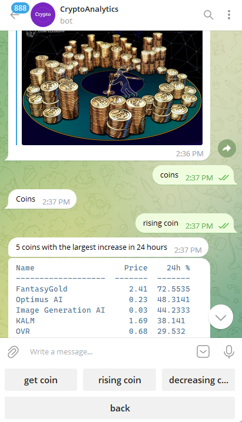

# CryptoBot
Telegram Bot

<a href="https://t.me/CryptoCurrencyPetBot">Visit CryptoBot</a>

<h3>So this is Telegram Bot about Crypto Analytics and here you can:</h3>
<ul>
  <li>Get info about me and bot</li>
   <li>Get info about a coin by its Name</li>
  <li>See the coins that have Risen in the last 24 hours</li>
  <li>See the coins that have Decrease in the last 24 hours</li>
  <li>Get crypto News and info about popular crypto Exchanges</li>

</ul>  

  
  
  

I used the next technologies and packages
<ul>
  <li>Python</li>
  <li>python-telegram-bot</li>
  <li>telebot</li>
  <li>Postgres</li>
  <li>SQLAlchemy</li>
  <li>Docker</li>
  <li>Third-party APIs</li>
</ul>  

